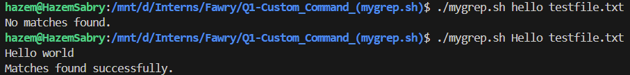
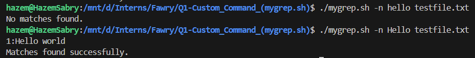
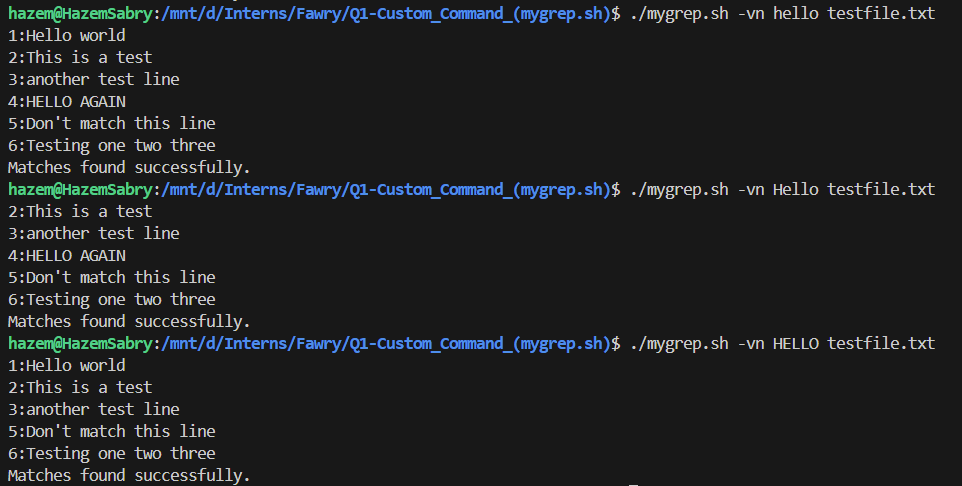
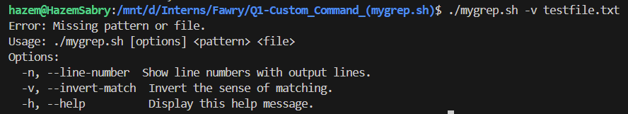

## Q1: Custom Command (mygrep.sh)

### Task Details:
You are tasked with creating a custom version of the `grep` command called `mygrep.sh`. The script should:
1. Search for a string in a file (case-insensitive).
2. Print matching lines or invert matches based on options.
3. Support the following options:
   - `-n`: Show line numbers for matches.
   - `-v`: Invert the match (print lines that do not match).
   - Combinations like `-vn` or `-nv` should work seamlessly.
4. Handle invalid inputs gracefully (e.g., missing arguments or files).
5. Mimic the output style of the `grep` command.

### Usage:
```bash
./mygrep.sh [options] <pattern> <file>
```

### Options:
- `-n, --line-number`: Show line numbers with output lines.
- `-v, --invert-match`: Invert the sense of matching.
- `-h, --help`: Display the help message.

### Example Commands:
1. Search for the word "hello" in `testfile.txt`:
   ```bash
   ./mygrep.sh hello testfile.txt
   ```
2. Search for "hello" with line numbers:
   ```bash
   ./mygrep.sh -n hello testfile.txt
   ```
3. Invert the match and show line numbers:
   ```bash
   ./mygrep.sh -vn hello testfile.txt
   ```
4. Missing search string (expect a warning):
   ```bash
   ./mygrep.sh -v testfile.txt
   ```

### Reflective Section:
1. **Argument and Option Handling**:
   - The script uses `getopts` for short options (`-n`, `-v`, `-h`) and a `for` loop for long options (`--line-number`, `--invert-match`, `--help`).
   - After parsing, the script validates the remaining arguments to ensure both a search pattern and a file are provided, and a if-statement checking on the flag to add the correct options to pass it to the grep command.

2. **Adding Regex or Additional Options**:
   - To support regex, the script would need to pass the `-E` option to `grep` for extended regular expressions, New cases (eg., `--regex`) in Check for long options.
   - For options like `-i` (case-insensitive), `-c` (count matches), or `-l` (list matching files), additional flags would be appended to the `options` variable based on user input, New cases (eg., `--insensitive`, `--count-matches`, `--list-matching-files`) Check for long options, and a if-statement checking on the flag to add the correct options to pass it to the grep command.

3. **Hardest Part**:
   - Handling combinations of options (`-vn`, `-nv`) was challenging because it required careful parsing and validation to ensure all flags were applied correctly.

### Testing Instructions:
1. Create a file `testfile.txt` with the following content:
   ```
   Hello world
   This is a test
   another test line
   HELLO AGAIN
   Don't match this line
   Testing one two three
   ```
2. Run the following commands and verify the output:
   - `./mygrep.sh hello testfile.txt`
   - `./mygrep.sh -n hello testfile.txt`
   - `./mygrep.sh -vn hello testfile.txt`
   - `./mygrep.sh -v testfile.txt` (expect a warning about the missing search string).
   **Screenshot Result**:
        - 
        - 
        - 
        - 

### Bonus Section:
1. **Support for `--help` Flag**:
   - The script includes a `--help` flag to display usage information and exit gracefully.
   - Example:
     ```bash
     ./mygrep.sh --help
     ```

2. **Improved Option Parsing**:
   - The script uses `getopts` for short options and a `for` loop for long options, ensuring flexibility and better error handling.

### Additional Notes:
- **Error Handling**:
  - The script checks for missing arguments, invalid options, and non-existent files, providing clear error messages to the user.
  - Example:
    ```bash
    ./mygrep.sh -x hello testfile.txt
    ```
    Output:
    ```
    Invalid option: -x
    Usage: ./mygrep.sh [options] <pattern> <file>
    ```

- **Case-Insensitive Search**:
  - The script performs case-insensitive searches by default, ensuring matches for patterns like "hello" and "HELLO".

- **Testing Environment**:
  - Ensure the script is executable by running:
    ```bash
    chmod +x mygrep.sh
    ```
  - Test the script with various combinations of options and inputs to validate its functionality.

### Future Improvements:
1. **Regex Support**:
   - Add support for regular expressions by passing the `-E` flag to `grep`.

2. **Additional Options**:
   - Implement options like:
     - `-i`: Explicit case-insensitive search.
     - `-c`: Count the number of matching lines.
     - `-l`: List only the names of files with matches.

3. **Enhanced Output**:
   - Format the output to highlight matching patterns for better readability.

4. **Unit Tests**:
   - Create automated tests to validate the script's behavior under different scenarios.

### Conclusion:
This custom `mygrep.sh` script provides a simplified version of the `grep` command with essential features like line numbering, inverted matching, and case-insensitive search. It is designed to handle errors gracefully and mimic the behavior of the original `grep` command as closely as possible.
