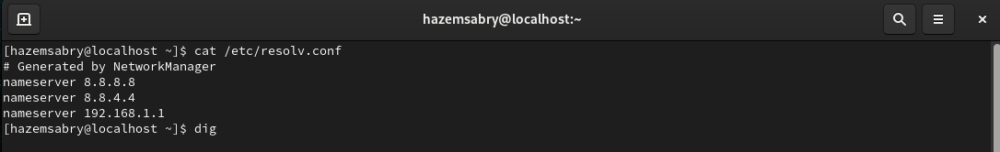
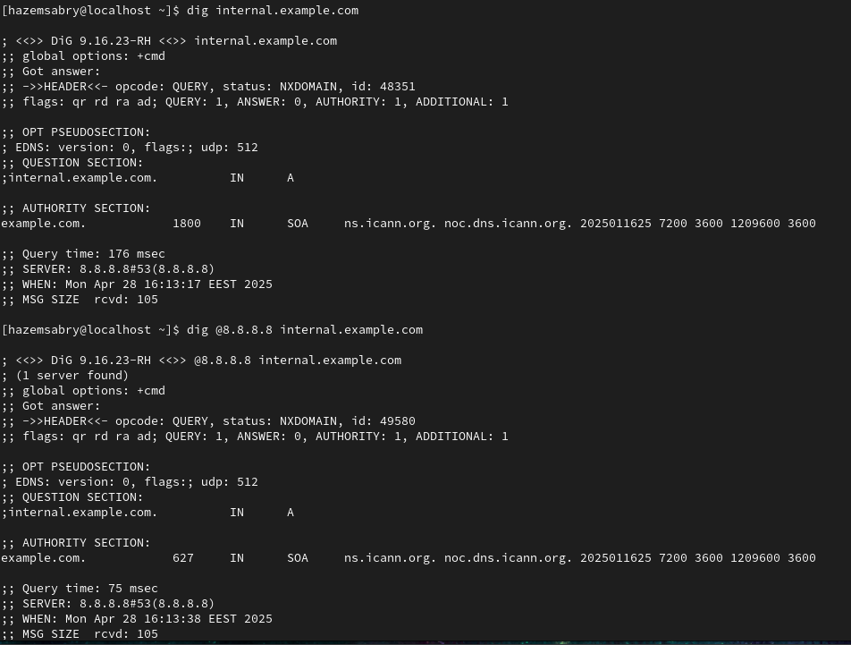

# Q2 : **Scenario**

Your internal web dashboard (hosted on `internal.example.com`) is suddenly unreachable from multiple systems. The service seems up, but users get “host not found” errors. You suspect a DNS or network misconfiguration. Your task is to troubleshoot, verify, and restore connectivity to the internal service.
  
## **🛠️ Task:**

1. Verify DNS Resolution:
Compare resolution from /etc/resolv.conf DNS vs. `8.8.8.8`.
2. Diagnose Service Reachability:
Confirm whether the web service (port 80 or 443) is reachable on the resolved IP.
Use curl, telnet, netstat, or ss to find if the service is listening and responding.
3. Trace the Issue – List All Possible Causes
**🧪** Your goal here is to identify and list all potential reasons why [internal.example.com](http://internal.example.com/) might be unreachable, even if the service is up and running. Consider both DNS and network/service layers.
4. Propose and Apply Fixes
✅ For each potential issue you identified in Point 3, do the following:
    1. Explain how you would confirm it's the actual root cause
    2. Show the exact Linux command(s) you would use to fix it
  
**🧠** **Note:**
Please include screenshots that demonstrate how you identified and resolved the issue
  
**🏆 Bonus:**
Configure a local /etc/hosts entry to bypass DNS for testing.
Show how to persist DNS server settings using systemd-resolved or NetworkManager.

## Solution

### Steps

1. DNS Verification
    cat /etc/resolv.conf output:
    
    dig internal.example.com output:
    dig @8.8.8.8 internal.example.com output:
    

2. Service Reachability
    Assume IP = 192.168.1.50
    - Using "*curl*":
        port 80:

        ```shell
        curl <http://192.168.1.50>
        ```

        port 443:

        ```shell
        curl <https://192.168.1.50>
        ```

    - Using "*telnet*":
        port 80:

        ```shell
        telnet 192.168.1.50 80
        ```

        port 443:

        ```shell
        telnet 192.168.1.50 80
        ```

    - Using "*netstat*":
        port 80:

        ```shell
        netstat -tuln | grep ':80'
        ```

        port 443:

        ```shell
        netstat -tuln | grep ':443'
        ```

    - Using "*ss*":
        port 80

        ```shell
        ss -tuln | grep ':80'
        ```

        port 443:

        ```shell
        ss -tuln | grep ':80'
        ```

3. Possible Causes
    - Wrong DNS server configured
    - Firewall blocking DNS or HTTP
    - Service not running (Apache, Nginx)
    - Wrong internal routing

4. Propose and Apply Fixes
    - "Correct /etc/resolv.conf", if dig works with 8.8.8.8 but not with your system DNS:
        update "/etc/resolv.conf" file to use working DNS (eg. 8.8.8.8, 8.8.4.4).
        restart systemd-resolved:

```shell
sudo systemctl restart systemd-resolved
```

- "Open firewall ports", if ports 53 (DNS), 80 (HTTP), and 443 (HTTPS) are not open.
        allow DNS, HTTP, and HTTPS ports:

```shell
# For DNS
sudo ufw allow 53
# For HTTP
sudo ufw allow 80
# For HTTPS
sudo ufw allow 443
# Reload firewall rules
sudo ufw reload
```

- "Restart web service (nginx/apache2)", if Service Not Running.
        restart nginx or apache2 service:

```shell
# For Apache
sudo systemctl start apache2
sudo systemctl enable apache2
# For Nginx
sudo systemctl start nginx
sudo systemctl enable nginx
```

### Bonus

- Configure a local /etc/hosts entry to bypass DNS for testing.
    Edit /etc/hosts to add:

```ini
192.168.1.50 internal.example.com
```

- Show how to persist DNS server settings using systemd-resolved or NetworkManager.
Persist DNS using systemd-resolved or NetworkManager.

#### 1. **Persist DNS Settings Using `systemd-resolved`**

1. **Edit the systemd-resolved configuration file:**

    ```shell
    sudo nano /etc/systemd/resolved.conf
    ```

2. **Add or modify the `DNS` and `FallbackDNS` settings:**
    - `DNS` is the primary DNS server.
    - `FallbackDNS` is a secondary DNS server (optional).
    Example:

    ```ini
    [Resolve]
    DNS=8.8.8.8 8.8.4.4
    FallbackDNS=1.1.1.1 1.0.0.1
    ```

3. **Restart the `systemd-resolved` service:**

    ```shell
    sudo systemctl restart systemd-resolved
    ```

4. **Enable `systemd-resolved` to start automatically on boot:**

    ```shell
    sudo systemctl enable systemd-resolved
    ```

5. **Verify that your DNS settings have been applied:**

    ```shell
    systemd-resolve --status
    ```

**Ensure `/etc/resolv.conf` is linked to `systemd-resolved`:**

```shell
sudo ln -sf /run/systemd/resolve/stub-resolv.conf /etc/resolv.conf
```

This ensures that `resolv.conf` points to the systemd-resolved configuration.

---

### 2. **Persist DNS Settings Using `NetworkManager`**

1. **Edit the NetworkManager configuration file for a specific connection:**
    NetworkManager allows you to configure DNS for individual network connections. You'll need to modify the `.nmconnection` file for the connection you want.
    To list your active connections:

    ```shell
    nmcli connection show
    ```

   Identify the connection you want to modify (for example, `Wired connection 1`).

2. **Modify the connection's DNS settings:**
    You can use `nmcli` to modify the DNS settings for the connection. Here's how to set the DNS servers to Google's DNS (8.8.8.8 and 8.8.4.4):

    ```shell
    sudo nmcli connection modify "Wired connection 1" ipv4.dns "8.8.8.8 8.8.4.4"
    ```

   You can also set DNS servers for IPv6 by modifying the `ipv6.dns` property in the same way.

    ```shell
    sudo nmcli connection modify "Wired connection 1" ipv6.dns "2001:4860:4860::8888 2001:4860:4860::8844"
    ```

3. **Restart NetworkManager to apply the changes:**

    ```shell
    sudo systemctl restart NetworkManager
    ```

4. **Verify that DNS settings are applied:**

   You can check the DNS settings by running:

    ```shell
    nmcli device show
    ```

   Look for the `IP4.DNS` and `IP6.DNS` entries under the relevant network interface.

---
